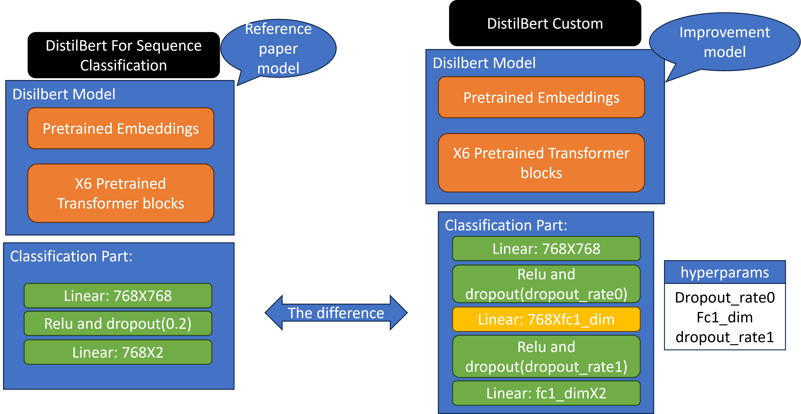

<h1 align="center">Human or GPT Project</h1>
<h2 align="center">Final project for the Technion's EE Deep Learning course (046211)</h2> 

  <p align="center">
    Noam Kasten: <a href="https://www.linkedin.com/in/shahar-yadin-069725195/">LinkedIn</a> , <a href="https://github.com/NoamKasten">GitHub</a>
  <br>
    Mohamad Abu El-Hija: <a href="https://www.linkedin.com/in/">LinkedIn</a> , <a href="https://github.com">GitHub</a>
  </p>


## Background
As Natural Language Processing (NLP) technologies continue to advance, the potential misuse of chatbots for malicious 
purposes, such as propagating misinformation, poses a significant societal challenge.

One of the domain possibilities to witness such a misuse and take as a test case is on restureant reviews.
Each restureant built its success mainly on reputation which is heavily based on human reviews. Some restureants can take advantage of Chatbots to create
guniune looking reviews. And on opposite approach - some restuarents can give bad reviews to other and can facilate such chatbots for the purpose of hurting competition.

Our project aims to identify a humane looking text (specifically restureant review) and decide if a human wrote it or a chatbot (specifically ChatGPT).
In our project 3 milestones:
1. Training a classifier to distinguish between Human made or GPT made on a given text.
Using SHAP we get a glimpse on the process of the decision of the classifier, i.e. which words on the sentence are accounts for the classification.
2. How does the model decide how to classify (using SHAP - as will explained next).
3. From the other side: How can we build a more sophisticated GPT prompts to make it harder to Differentiate between human and bot.

The overall process is as following:


Steps 2 and 3 are done using SHAP methodology

## SHAP

SHAP (SHapley Additive exPlanations) is a approach to explain the output of any machine learning model and in our case - classification model. The process is mainly as the following steps: 
1. Firstly, calculate the prediction score on the given sentence.
2. Remove the word of interest from the sentence and then recalculate the prediction score.
3. The SHAP value of the word is the difference in the prediction score.

High absolute SHAP value indicates that the word is important for the classification: a positive SHAP value means the word pushes the model towards predicting the sentence as AI-generated, and a negative SHAP value means the word pushes the model towards predicting the sentence as human-generated.


## Datasets
As said, we used the classifier on the domain of restaurant reviews where we used datasets created by us using GPT3.5 and 
GPT4 and datasets created by GPT3 which were kindley provided to us by the authors of the paper #TODO , which we had as our background
theory that we extended and provided additional steps.
The code for the openAI API and the prompts are presented in Utils folder 

So the overall presented datasets are the following:
1. Rephrased from the dataset from the paper GPT3 and its test set.
2. Rephrased from the GPT API using GPT 3.5 and its test set (that we've created).
3. Generated from the dataset from the paper
4. Generated from the GPT 4 (that we created)
5. Test set created by SHAP methodology.

Overall 7 datasets, and all are within the Datasets folder.

## Block diagram of the whole system:


## Process and Results
We are examining two different transformer based classification models:

Where we're tuning the hyperparams using Optuna. The parameters 
for the models are presented in "Configurations" folder.


### Models' results on the datasets


### Conclusion on the first part - building the classification models:
1. It seems that the “generated” dataset of older versions of GPT are too much generic and easy to distinguish (99%~). GPT 4 generated dataset is harder to distinguished but still relatively easy (91%~).
2. “Rephrased” datasets are harder (75%~) to differentiate as they keep the notions and definitions as in the respective human comment.
3. The custom head done better in 2 of the experiments (small improvements, 2%~) but seems to overfit in one of the experiments (7% less than the reference model)

### Second part: SHAP extraction to understand the models' decision
Using shap we extracted few examples of different types of classificaitons:


Using the weights, we were able to create words clouds of the words presented in the sentences and their orienations:


### Third part: Using part 2's knowledge to create more sophisticated prompts
Using the rephrased models, we can take the test set's human reviews and rephrase them using our SHAP statistics.
Such an example for prompt is presented in the following flow:


The technical detalis on the last part are as the following:

<p float="left">
  
</p>


## Installation

Clone the repository and run
```
$ git clone https://github.com/noamkasten/HumanOrGPT.git
$ pip install prereq
$ python main.py
```

## Config


## Files in the repository

| File name                                                     | Purpsoe                                                                                                                                       |
|---------------------------------------------------------------|-----------------------------------------------------------------------------------------------------------------------------------------------|
| `main.py`                                                     | general purpose main application                                                                                                              |
| `trainer.py`                                                  | main application for training BYOL-ViT or linear classifier model                                                                             |

## Running Example
### Training
* how to train 

### Test using test sets

### Single sentence inference
* run `python single.py`


## References 
* The project's theory is based on the paper: Mitrović, Sandra, Davide Andreoletti, and Omran Ayoub. "Chatgpt or human? detect and explain. explaining decisions of machine learning model for detecting short chatgpt-generated text." arXiv preprint [arXiv:2301.13852 (2023)](https://arxiv.org/pdf/2301.13852.pdf).